# Lab7Web
## PHP Dasar
### Langkah - langkah Pratikum 7

#### membuat folder lab7_php_dasar
Dengan menambahkan (document.write dan console.log) untuk membuat dokumen HTML, menulis ke dalam output HTML dan ke konsol browser. Beginilah tampilannya:
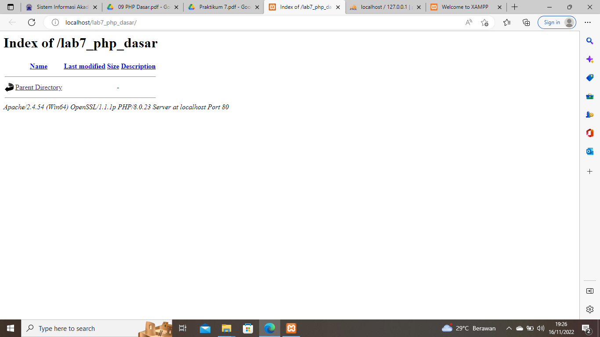

#### Membuat PHP Dasar
Pemakaian Alert sebagai property window.. Inilah tampilannya:
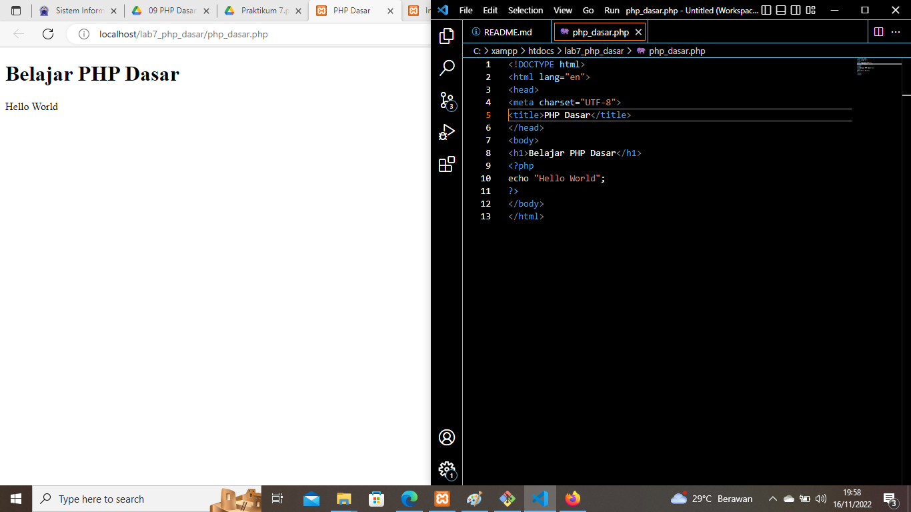

#### Variable PHP
Inilah tampilannya:
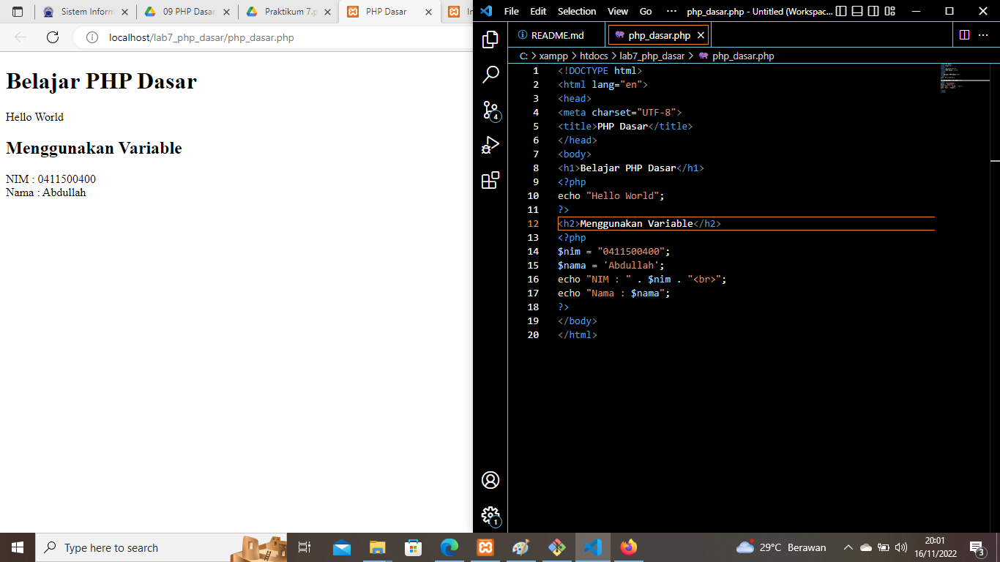

#### Predefine Variable $_GET
dengan menambahkan alert. berikut tampilannya :
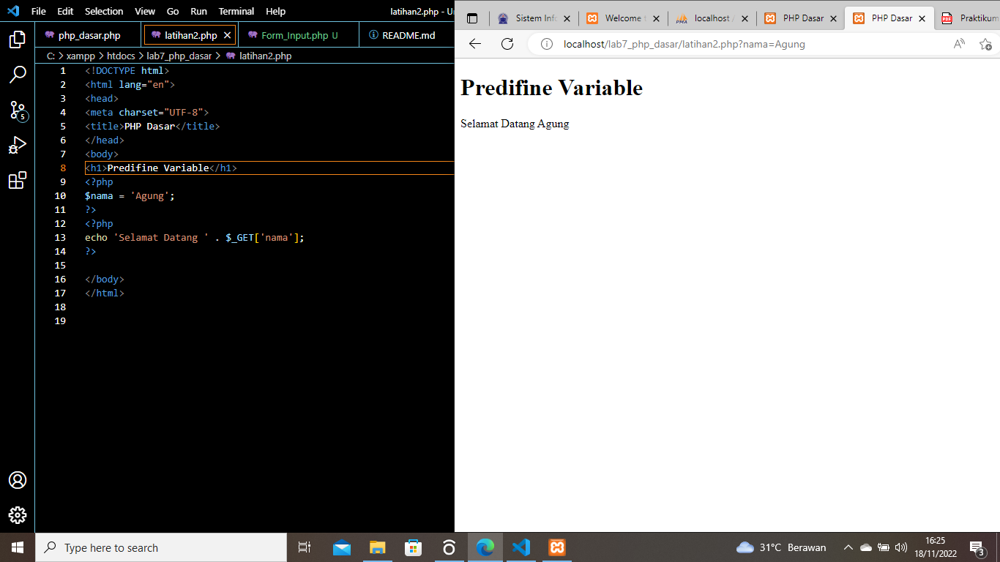

#### Membuat Form Input
Dengan menambahkan document.write.  Berikut tampilannya:
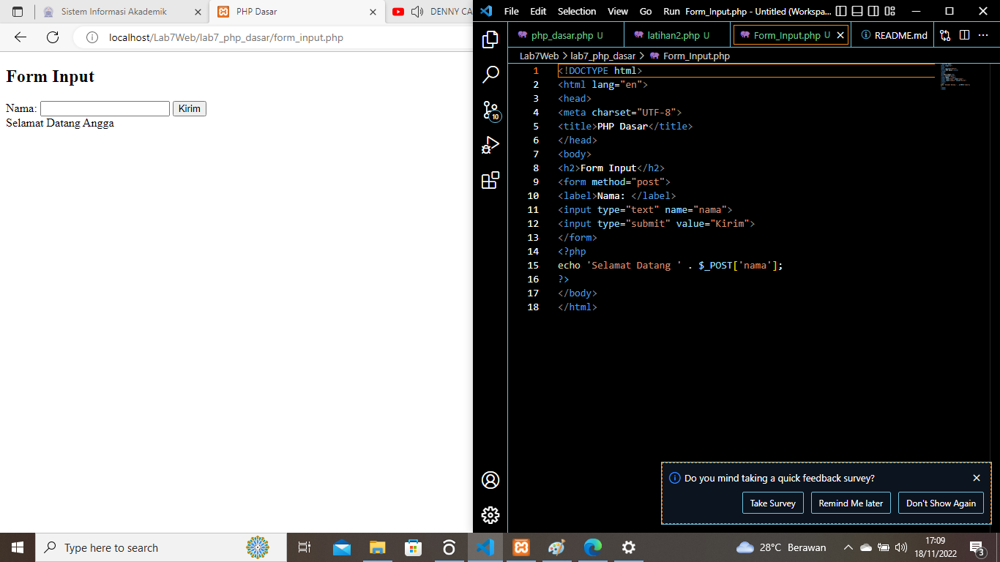

#### Operator
Dengan menambahkan document.write pada else . Berikut tampilannya:
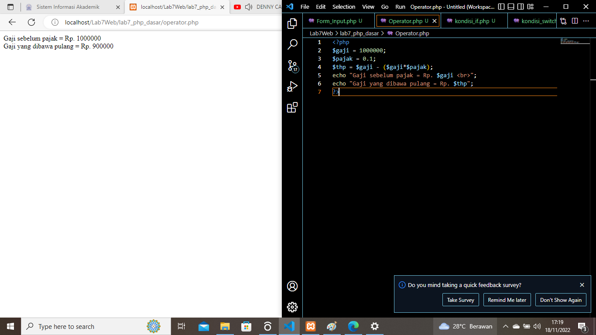

#### Kondisi IF
Berikut ini adalah tampilan dari praktek yang saya lakukan:
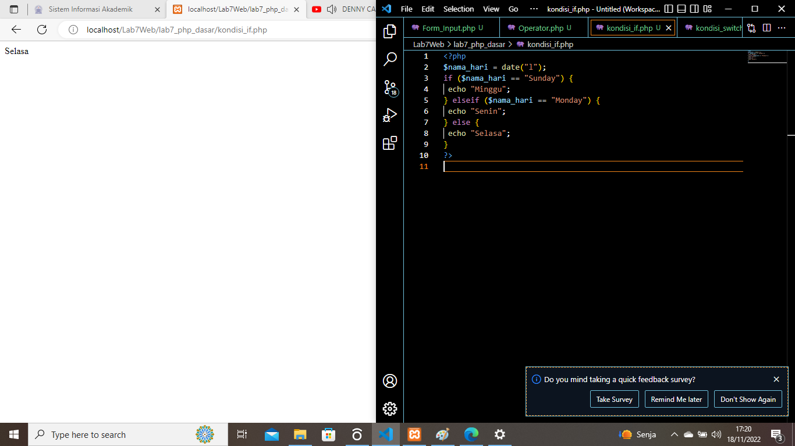

#### Kondisi Switc
Berikut ini adalah tampilan dari praktek yang saya lakukan:
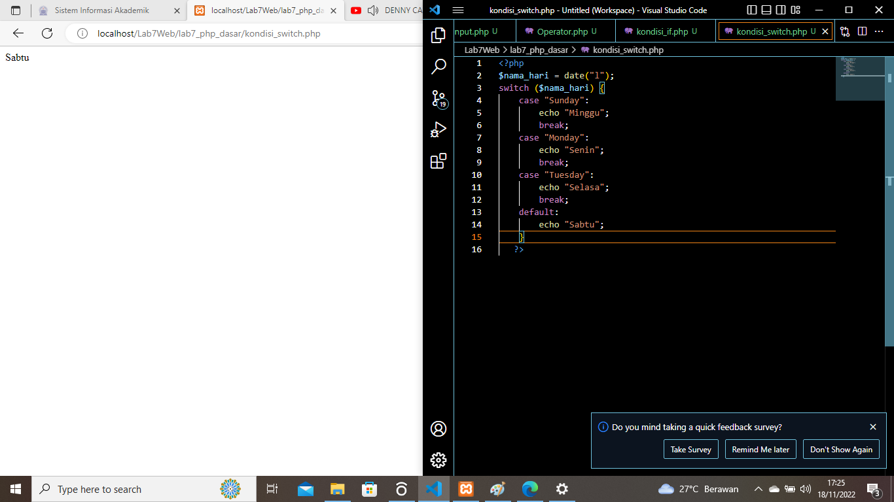

#### Perulangan for
Berikut ini adalah tampilan dari praktek yang saya lakukan:
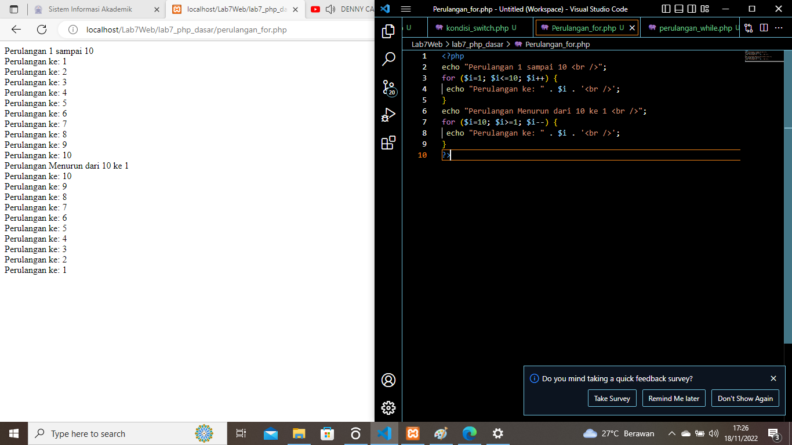

#### Perulangan while
Berikut ini adalah tampilan dari praktek yang saya lakukan:
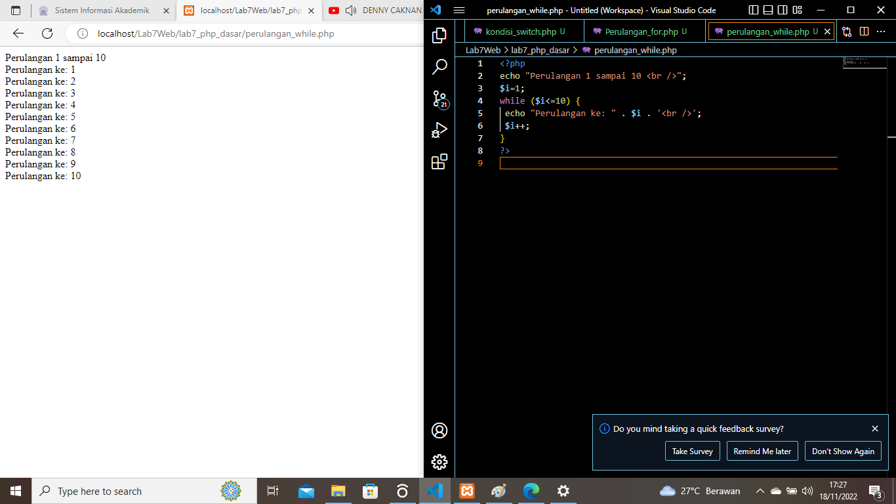

#### Perulangan dowhile
Berikut ini adalah tampilan dari praktek yang saya lakukan:
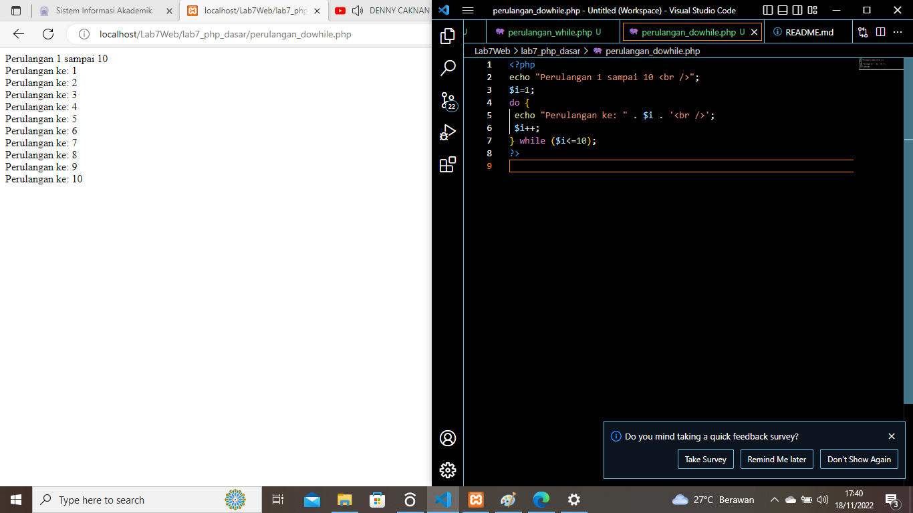

#### Hasil Tugas Program PHP Sederhana
Berikut ini adalah tampilan dari praktek yang saya lakukan:
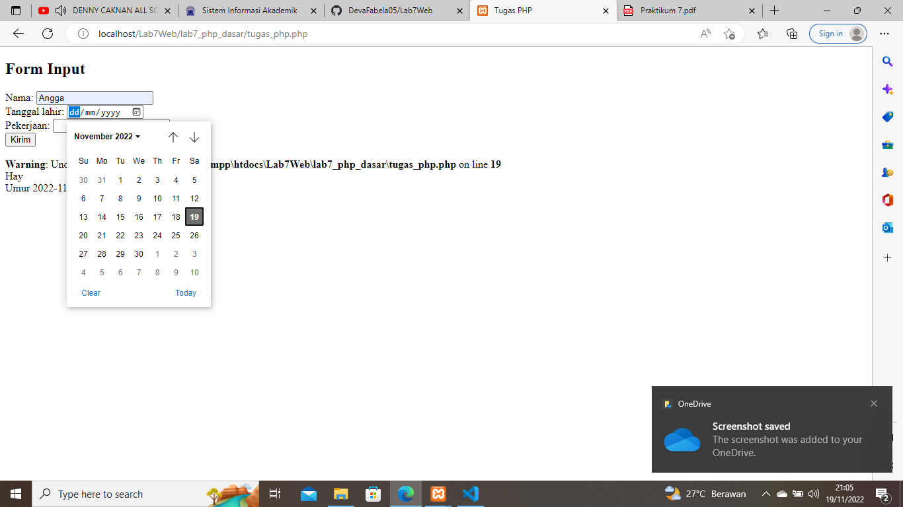

